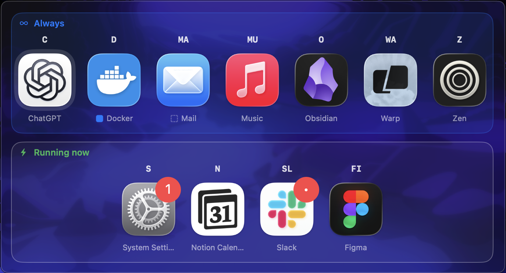
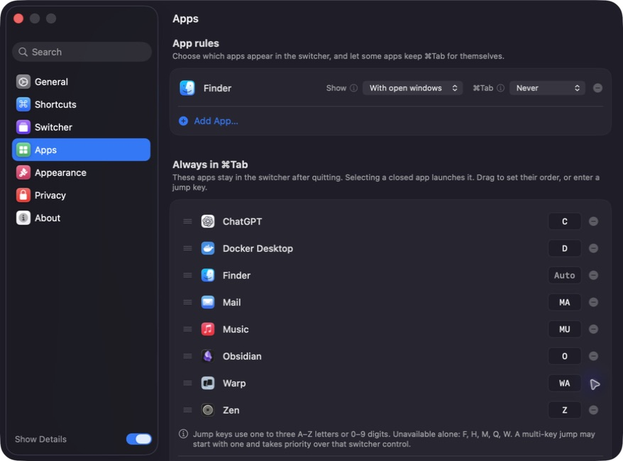

<div align="center">


# StayTab

**매일 쓰는 앱을 종료한 뒤에도 Command-Tab의 같은 자리에 유지해요.**

[](https://github.com/kang1027/StayTab/actions/workflows/app-ci.yml)
[](LICENSE)
[](https://www.apple.com/macos)
[](https://swift.org)

[English](README.md) · **한국어**

<br>



<sub>고정 앱은 Always 영역을 유지해요. 종료된 Docker는 바로 실행할 수 있고, 임시 앱은 Running now에만 표시돼요.</sub>

</div>

## Command-Tab 안의 고정된 내 자리

macOS 기본 앱 전환기는 실행 중인 앱만 기억해요. StayTab은 매일 쓰는 앱을 위한 고정 영역을 만들고, 잠깐 사용하는 앱은 별도의 실행 중 영역에 보여줘요.

| 항상 Command-Tab에 표시 | 현재 실행 중 |
| --- | --- |
| 고정한 앱은 종료해도 순서와 자리를 유지해요. | 나머지 앱은 실행 중일 때만 나타나요. |
| 종료된 앱을 선택하면 같은 자리에서 다시 실행해요. | 앱을 종료하면 목록에서도 자연스럽게 사라져요. |
| `K`, `FI`, `SET` 같은 키로 원하는 앱에 바로 이동해요. | 별도의 등록이나 정리가 필요 없어요. |

`⌘Tab`을 짧게 누르면 이전에 사용하던 앱으로 바로 돌아가요. 길게 누르면 StayTab이 열리고, `⌘⇧Tab`으로 반대로 이동하며, 선택한 창에는 즉시 키보드 포커스가 들어가요.

## 고정 영역 설정하기

<div align="center">



<sub>순서를 한 번 정한 뒤 자동 또는 사용자 지정 한 자에서 세 자까지의 점프 키로 이동할 수 있어요.</sub>

</div>

## 주요 기능

- **고정 앱 목록.** 메일, 브라우저, 터미널, 노트, 음악처럼 매일 쓰는 앱을 예측 가능한 순서로 유지해요.
- **종료된 앱 다시 실행.** 앱을 종료해도 목록에서 사라지지 않으며 같은 자리에서 다시 열 수 있어요.
- **명확한 영역 분리.** 고정 앱과 잠깐 실행한 앱을 서로 다른 영역에 표시해요.
- **빠른 점프 키.** 앱 이름의 가장 짧은 사용 가능 접두사를 최대 세 글자까지 자동 배정하며, 문자와 숫자 조합을 직접 지정할 수도 있어요.
- **macOS다운 전환.** 빠른 `⌘Tab`, 역방향 전환, 창 포커스, Space, 최소화 창, 키보드 입력을 자연스럽게 처리해요.
- **로컬 우선.** 계정, 텔레메트리, 분석, 원격 앱 사용 기록이 없어요.

StayTab은 업그레이드 호환성을 위해 BetterCmdTab의 기존 설정 형식을 읽을 수 있지만, 설정 화면은 고정 앱 전환에 필요한 기능만 보여줘요. 창 관리 단축키, 세부 입력 조정, 브라우저 탭 제어, 범위별 프로필은 의도적으로 숨겼어요. 기준은 [제품 범위](docs/PRODUCT.md)에서 확인할 수 있어요.

## 설치

### DMG 다운로드 — 권장

첫 Apple 공증 버전인 `v0.1.0`을 준비 중이에요. 공개된 뒤에는 다음 순서로 설치해요.

1. [GitHub Releases](https://github.com/kang1027/StayTab/releases/latest)에서 `StayTab-*.dmg`를 내려받아요.
2. DMG를 열고 **StayTab**을 Applications 폴더로 옮겨요.
3. StayTab을 실행하고 macOS가 요청할 때 손쉬운 사용 권한을 허용해요.

DMG는 처음 설치할 때만 필요해요. 이후에는 StayTab이 서명된 GitHub 릴리스를 확인할 수 있어요. **설정 → 일반 → 업데이트 확인**에서 확인 주기를 선택하고, 시험판이 필요한 경우에만 **베타 릴리스 포함**을 켜면 돼요.

공식 바이너리는 Developer ID로 서명하고 Apple 공증을 거치며 GPL-3.0 대응 소스를 함께 제공해요. 로컬 테스트 빌드는 재배포하면 안 돼요.

초기 릴리스에서는 Homebrew 설치를 안내하지 않아요. 첫 릴리스가 안정화될 때까지 DMG 직접 설치와 인앱 업데이트를 공식 배포 경로로 사용해요.

### 소스에서 빌드

Xcode 26 이상이 필요해요. 앱은 macOS 13 Ventura 이상과 Apple Silicon·Intel Mac을 지원해요.

```sh
git clone https://github.com/kang1027/StayTab.git
cd StayTab

xcodebuild \
  -project BetterCmdTab.xcodeproj \
  -scheme "BetterCmdTab Debug" \
  -configuration Debug \
  CODE_SIGNING_ALLOWED=NO \
  build
```

업스트림 기록과 호환성을 보존하기 위해 Xcode 프로젝트와 소스 모듈 이름은 `BetterCmdTab`을 유지해요. 생성되는 제품은 `StayTab`이고 번들 식별자는 `com.kdh.StayTab`이에요.

## 권한과 개인정보

StayTab은 전환 단축키를 확인하고 선택한 창에 포커스를 주기 위해 손쉬운 사용 권한을 사용해요. 현재 StayTab 설정 화면은 브라우저 자동화 또는 전체 디스크 접근 권한을 요청하지 않아요.

창 제목, 앱 상태, 최근 사용 순서, 환경설정은 Mac 안에만 남아요. 지원하는 유일한 네트워크 통신은 사용자가 활성화한 GitHub Releases 업데이트 확인이에요. 자세한 내용은 [개인정보 처리](PRIVACY.md)와 [보안 정책](SECURITY.md)을 확인해 주세요.

## 개발

전체 테스트는 다음 명령으로 실행해요.

```sh
xcodebuild \
  -project BetterCmdTab.xcodeproj \
  -scheme "BetterCmdTab Debug" \
  -destination "platform=macOS" \
  CODE_SIGNING_ALLOWED=NO \
  test
```

현재 테스트는 전환 라우팅, 앱 순서, 점프 라벨, 포커스 복구, 설정 이식, 브라우저 탭, 창 관리, 렌더링 로직을 다뤄요. macOS 손쉬운 사용 권한이 필요한 UI 경로는 수동으로 확인해요.

## 기여하기

이슈와 풀 리퀘스트를 환영해요. 변경 범위를 작게 유지하고, 네이티브 AppKit 사용 경험을 보존하며, WindowServer에서 분리할 수 있는 동작에는 테스트를 추가해 주세요.

[기여 가이드](CONTRIBUTING.md) · [지원](SUPPORT.md) · [행동 강령](CODE_OF_CONDUCT.md) · [릴리스 가이드](RELEASING.md)

## 라이선스와 원본

StayTab은 [GNU General Public License v3.0](LICENSE)으로 배포해요. 수정본을 배포할 때는 같은 라이선스를 유지하고 완전한 대응 소스를 제공해야 해요.

이 프로젝트는 [@rokartur](https://github.com/rokartur)와 기여자들이 만든 [BetterCmdTab](https://github.com/rokartur/BetterCmdTab)의 수정 배포판이에요. 원본 저작권, 기여 기록, GPL-3.0 권리를 보존해요. StayTab은 BetterCmdTab의 공식 제품이나 보증을 받은 배포판이 아니에요. 변경 및 저작권 고지는 [NOTICE.md](NOTICE.md)를 확인해 주세요.
