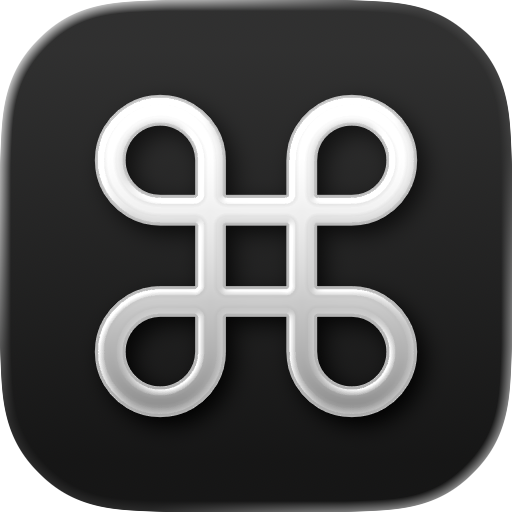
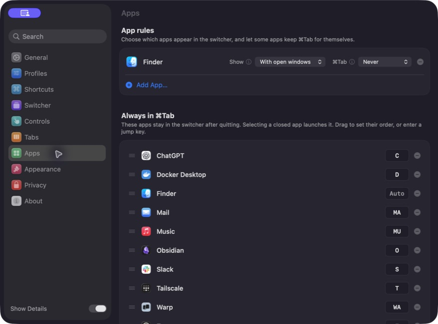

<div align="center">



# StayTab

**Keep your everyday apps in Command-Tab — even when they are closed.**

[](https://github.com/kang1027/StayTab/actions/workflows/app-ci.yml)
[](LICENSE)
[](https://www.apple.com/macos)
[](https://swift.org)

**English** · [한국어](README.ko.md)

<br>



<sub>Build a permanent app roster, choose its order, and assign one-to-three-character jump keys.</sub>

</div>

## A stable home inside Command-Tab

The native macOS switcher only remembers apps that are running. StayTab adds a permanent lane for the apps you use every day while keeping temporary apps in a separate running section.

| Always in Command-Tab | Running now |
| --- | --- |
| Your pinned roster stays ordered and visible after an app quits. | Everything else appears only while it is running. |
| Pick a closed app to launch it again. | Quit the app and it leaves the switcher naturally. |
| Type `K`, `FI`, or `SET` to jump directly to a matching app. | No setup or cleanup required. |

Quick-tapping `⌘Tab` still returns to the previously focused app. Holding it opens StayTab, `⌘⇧Tab` moves backwards, and the selected window receives keyboard focus immediately.

## Highlights

- **Persistent pinned apps.** Keep Mail, your browser, terminal, notes, music, and other daily tools in a predictable order.
- **Closed-app launch.** A pinned app remains selectable after quitting and launches from the same slot.
- **Clear visual grouping.** Pinned apps and temporary running apps occupy separate sections.
- **Fast jump keys.** Automatic labels use the shortest available app-name prefix, up to three letters or digits. Custom combinations are supported too.
- **Native switching semantics.** Quick `⌘Tab`, reverse switching, window focus, Spaces, minimized windows, and keyboard input behave like a Mac switcher should.
- **Local by design.** No account, telemetry, analytics, or remote app-usage history.

StayTab retains BetterCmdTab's advanced switching engine for compatibility. Profiles, browser tabs, window layouts, search, and detailed panel controls are power-user features rather than the core product promise. See [Product scope](docs/PRODUCT.md).

## Install

### Signed release

The first notarized `v0.1.0` release is being prepared. When it is published, download the `.dmg` from [GitHub Releases](https://github.com/kang1027/StayTab/releases/latest), open it, and drag **StayTab** to Applications.

Do not redistribute local test builds. Official binaries will be signed with a Developer ID, notarized by Apple, and accompanied by their GPL-3.0 source.

### Homebrew

The repository contains the Cask and release automation. After the first release:

```sh
brew tap kang1027/staytab https://github.com/kang1027/StayTab.git
brew install --cask kang1027/staytab/staytab
```

### Build from source

Requires Xcode 26 or later. The app runs on macOS 13 Ventura or later, on Apple Silicon and Intel Macs.

```sh
git clone https://github.com/kang1027/StayTab.git
cd StayTab

xcodebuild \
  -project BetterCmdTab.xcodeproj \
  -scheme "BetterCmdTab Debug" \
  -configuration Debug \
  CODE_SIGNING_ALLOWED=NO \
  build
```

The project and source-module names remain `BetterCmdTab` to preserve upstream history and compatibility. The built product is `StayTab`, with bundle identifier `com.kdh.StayTab`.

## Permissions and privacy

StayTab needs Accessibility permission to observe the switch shortcut and focus the selected window. Browser-tab switching may additionally request Automation or Full Disk Access, depending on the browser and feature used.

Window titles, app state, recent ordering, and preferences stay on the Mac. The only supported network traffic is an opt-in GitHub Releases update check. See [Privacy](PRIVACY.md) and [Security](SECURITY.md).

## Development

Run all tests with:

```sh
xcodebuild \
  -project BetterCmdTab.xcodeproj \
  -scheme "BetterCmdTab Debug" \
  -destination "platform=macOS" \
  CODE_SIGNING_ALLOWED=NO \
  test
```

The current suite covers switcher routing, app ordering, jump labels, focus recovery, settings portability, browser tabs, window management, and rendering logic. UI paths that require macOS Accessibility are verified manually.

## Contributing

Issues and pull requests are welcome. Please keep changes focused, preserve the native AppKit experience, and include tests for behavior that can be isolated from the WindowServer.

[Contributing guide](CONTRIBUTING.md) · [Support](SUPPORT.md) · [Code of Conduct](CODE_OF_CONDUCT.md) · [Release guide](RELEASING.md)

## License and upstream

StayTab is distributed under the [GNU General Public License v3.0](LICENSE). Distributed modifications must keep the same license and provide the corresponding source.

This project is a modified distribution of [BetterCmdTab](https://github.com/rokartur/BetterCmdTab), created by [@rokartur](https://github.com/rokartur) and its contributors. Their copyright, contribution history, and GPL-3.0 rights are preserved. StayTab is not an official BetterCmdTab product or an endorsed distribution. See [NOTICE.md](NOTICE.md) for the change and attribution notice.
